Assuming that you have all of the parts pre-printed and have never assembled an OmniBox, it takes about one hour for assembly. This does not include the time needed to run and attach wiring.

!!! note
    These instructions are for the default OmniBox configuration (two 40mm fans for the rear main body and no front body fan). They cover aspects common to all OmniBox printers and demonstrate mounting fan cages. The size and location of fans in your configuration may vary.

## 1. Base

You will need:

- 4x M4 x 16mm screws (20mm will work)
- 1x SPST toggle switch
- The printed front and rear base

| Step | Example |
|------|---------|
| The two pieces of the base both have two (2) holes on each side. Use the four (4) M4 screws to fasten them together. **Note:** Make sure the sawtooth air vents on both halves are facing the same direction, as in the picture. |  |
| Push the power switch into the cutout in the front of the base. The sides of the switch will compress until it snaps into place. |  |

## 2. Main Body

You will need:

- 6x M3 x 8 screws (8-12mm will work)
- 8x #6 x 3/4" screws (see note below)
- 2x M3 x 16mm screws (20mm will work)
- 4x M4 x 6mm screws (see caution below)
- The printed front and rear main body
- The printed front crossbar
- Your power supply unit (PSU)

!!! note
    Sharp point screws are easier to use than machine scews for attaching the main body and base. For this you can use #6 x 3/4" screws (SAE) or M3 x 20mm (metric) screws found at any hardware store. If these are not convenient or available, machine screws will work in their place.
    
!!! caution
    Always stop if you feel resistance when fastening screws to the power supply.
    
    Screws longer than 6mm may touch components in the power supply and short or damage them. Some models have clearance for 8mm screws.    

| Step | Example |
|------|---------|
| Assemble the front and rear using six (6) M3 x 8mm screws. **Note**: Insert the screws from the back to the front of the case. | 
| Here we have all six screws inserted. The fans in the photos were added early; we will do those shortly.| |
| Line up the holes on the top of the power supply with the main body. The power supply sit underneath is slightly offset towards the front right. |  |
| Mount the power supply using four (4) M4 x 8mm screws. | [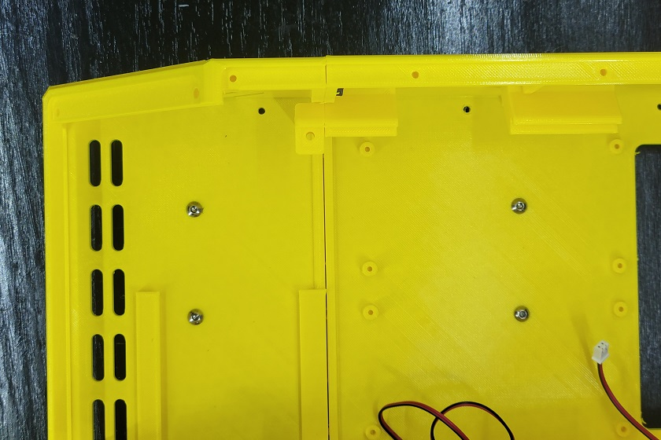](img/psu_finished.jpg) |
| Place the assembled main body on top of the base. There are eight (8) holes near the outside walls. | [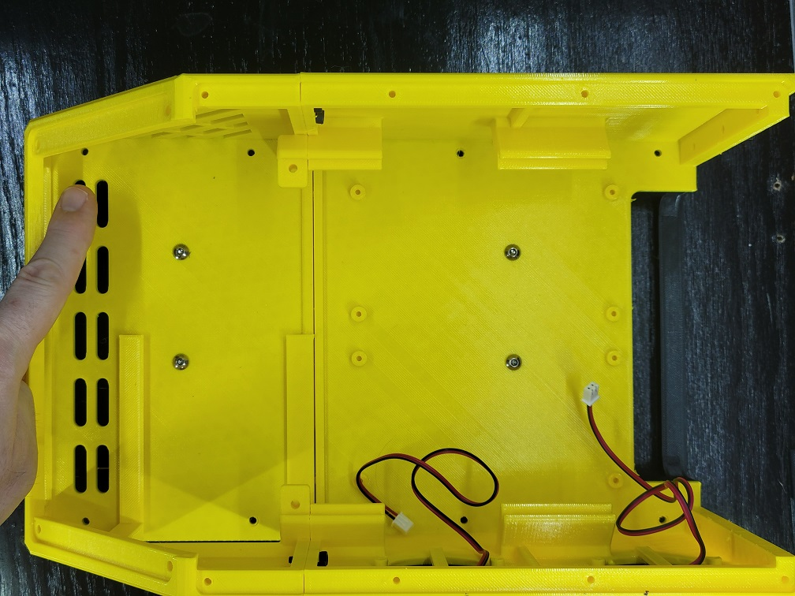](img/base_holes.jpg) |
| Fasten the main body and base together with your long M3 screws or sheet metal screws. |  |
| Place the crossbar in place at the joint between the lid and display mounts. Take note of the orientation in the picture. | [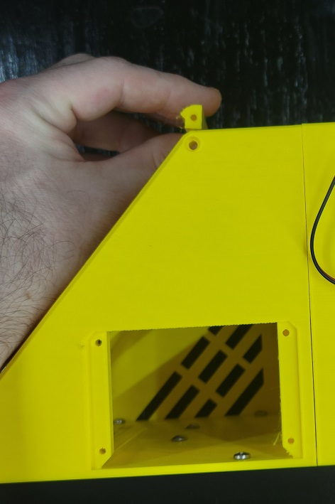](img/crossbar_location.jpg)
| Attach the crossbar with an M3 x 16mm screw in each side. | 

## 3. Dual 40mm Exhaust Fans

You will need:

- 8x M3 x 16mm screws (14mm or 15mm will also work, but these lengths are uncommon)
- 2x 40x40x10mm fans
- 2x printed 40mm fan cages
- (Optional) 2x printed TPU gaskets

| Step | Example |
|------|---------|
| Place a fan inside the cage with the stickered side of the motor facing towards the fan grill. | |
| Insert two M3 screws on opposite sides of the fan cage and through the fan's mounting holes. | 
| Thread the fan's wires through the fan cutout in the main body, then line up the fan and cage with the mounting holes. | |
| Partially tighten both screws until at least two full turns of thread are holding the fan in place. | [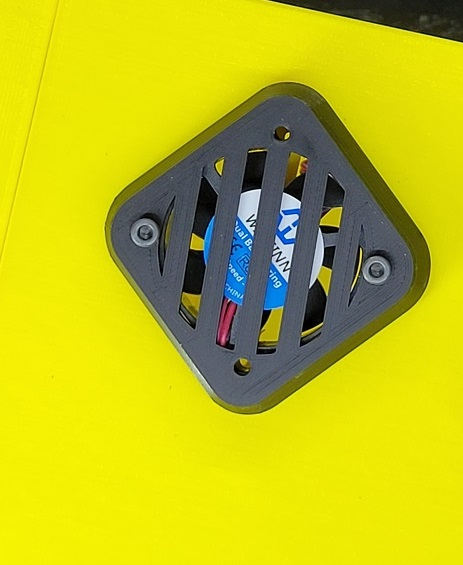](img/fan_screws2.jpg)
| Insert and tighten the other two M3 screws. Finish tightening the screws until all four screws are firmly in place. | [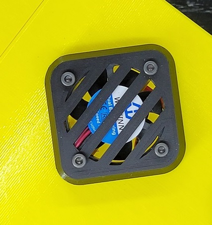](img/fan_finished.jpg) |
| Ensure the fan wire feeds through the cutout without pinching or binding. | |
| Repeat the above process for the second fan. | [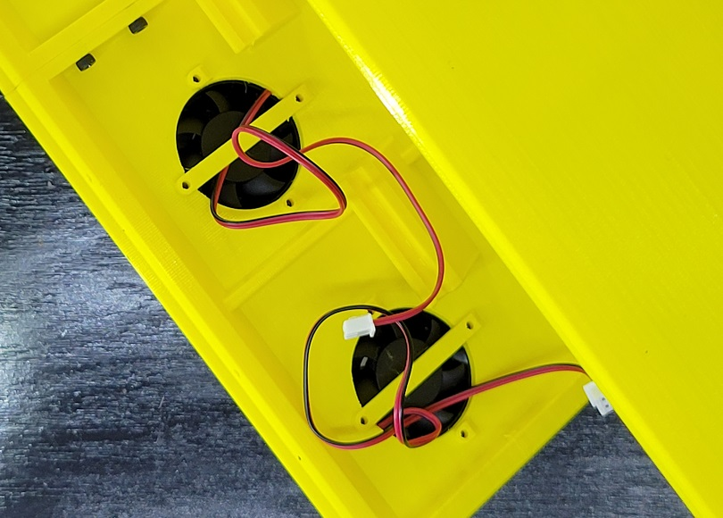](img/fan_wires.jpg) |

## 4. CPU Tray

You will need:

- 4 M3 x 6mm screws
- 4 M3 x 8mm screws
- A Raspberry Pi 3B+ or 4B (or other SoC CPU)
- A printed CPU tray matching your SoC CPU

!!! note
    The Raspberry Pi comes with M2.5 screw holes, but can be bored out easily with M3 screws.

| Step | Example |
|------|---------|
| Mount your Raspberry Pi with 6mm M3 screws onto the tray. |  |
| Slide the tray into the side bay on the left side. |  |
| Use M3 x 8mm screws to fasten the tray in place. |  |

## 5. MCU Tray

You will need:

- 4x M3 x 6mm screws
- 2x M4 x 8mm screws
- Your MCU (e.g., BIGTREETECH Octopus)
- The printed tray for your MCU

!!! note
    The MCU tray has two M4 screw holes on the sides. These screw holes face forward when inserted in the case. When attaching your MCU to the tray, align your SD card connector toward the front and power connectors toward the back.

| Step | Example |
|------|---------|
| Attach your MCU with the four (4) M3 x 6mm screws to the tray. | [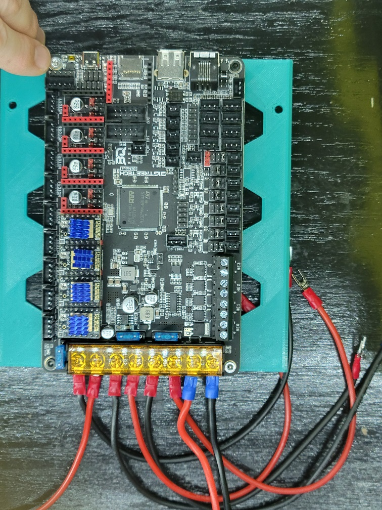](img/mcu_screws.jpg) |
| Slide the tray from the back of the assembled case to the front. Stop when the screw holes in the tray align with the ones in the main body. | [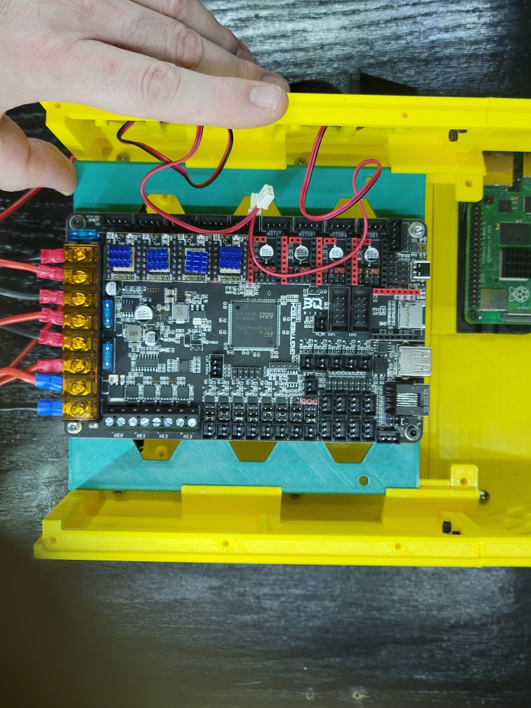](img/mcu_install.jpg) |
| Tighten the tray in place with two (2) M4 x 8mm screws. |  |
| Connect your PSU and MCU. **Be careful of polarity.** | [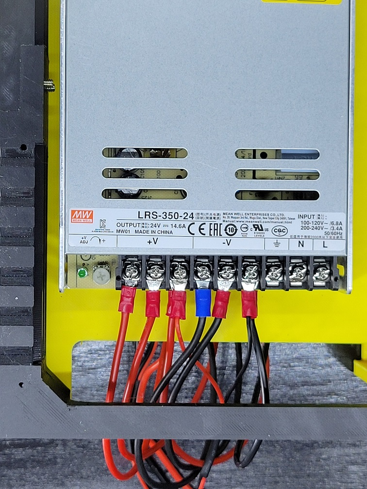](img/mcu_psu_wires.jpg) |

## 6. Front Panel

You will need:

- 2x M3 x 8mm screws
- Your printed front panel
- Any accessories that mount to it and fasteners for them

| Step | Example |
|------|---------|
| If you have any add-ons for your front panel (such as a MicroSD extension) install these first. |  |
| Insert the front panel and attach with two (2) M3 screws. | |

## 7. Rear Panel

You will need:

- 8x M4 x 8mm screws
- Your printed rear panel
- Any connectors or other accessories for the rear panel

| Step | Example |
|------|---------|
| If you are using the rear panel to mount connectors, it is strongly advised that you insert the connectors to the panel first, before installing the panel or connecting any wires to the board. |  |
| Line up the rear panel with the cutout on the assembled case. Check where the screw holes line up. If any are clearly unaligned, leave those for last. | |
| Starting with a screw hole near the top, partially thread an M4 screw in. Once you can feel the screw threads grab the main body, insert two full turns and stop. |  |
| Partially thread another screw the same way on the other side. |  |
| Continue to insert screws into the remaining holes, alternating the left and right sides. If any of the holes are still unaligned, you can try to insert a screw at an angle and thread. The screw may work itself straight; if not, leave the hole empty. |  |
| Finish tightening all of the screws. | [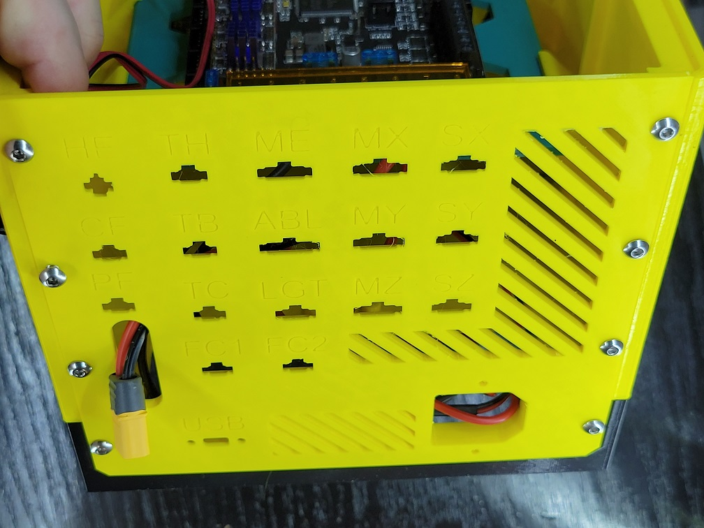](img/rear_finished.jpg) | 
| Wire the front power switch, IEC power connector, and PSU. As always, be careful of polarity. | |

## 8. Display Screen

You will need:

- 4x M3 x 6mm screws
- 4x M4 x 8mm screws
- Your printed display mount
- Your display

!!! note
    Some display mounts have more than one piece and require additional screws. The below is an example with a stock Creality 12864 display.

| Step | Example |
|------|---------|
| Remove the knob on the display screen. It should pull off. | 
| Slide the screen into place on the mount and fasten with four (4) M3 x 6mm screws. | [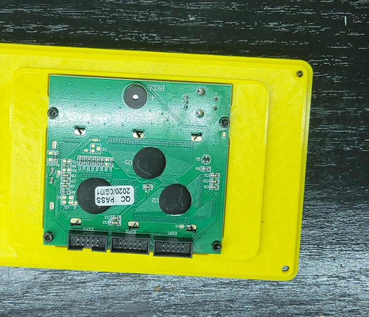](img/display_screen.jpg) |
| Re-attach the knob to the display screen. Again, it should slide into place with light force. If your display mount has multiple pieces, attach those now (usually only applies to displays with side-mount SD card readers). | |
| Attach the display connectors and slide the cables in before the display. | [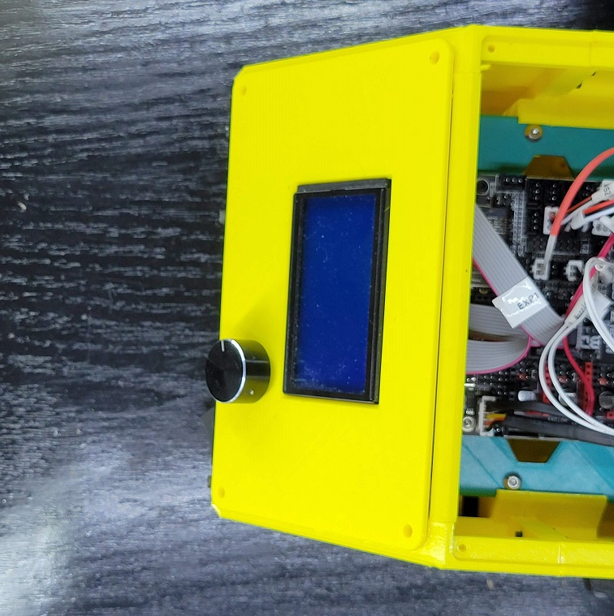](img/display_connectors.jpg) |
| Attach the display panel with two (2) M4 x 8mm screws on opposings sides. Avoid overtightening. | [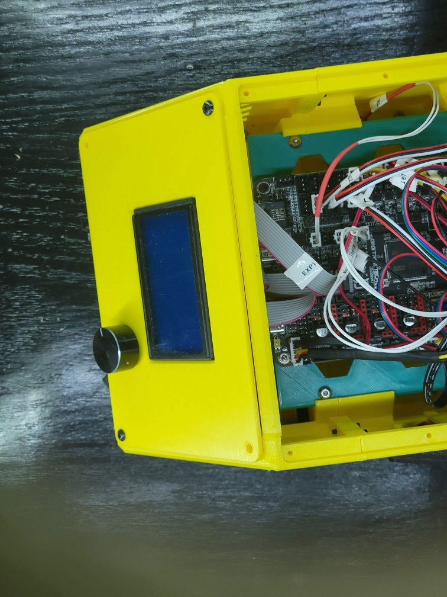](img/display_screws1.jpg) |
| The angle of the display may require inserting the remaining two (2) screws at an angle. You may also need to back out the first screws slightly and angle them as well. This is an artifact of the display angle. | [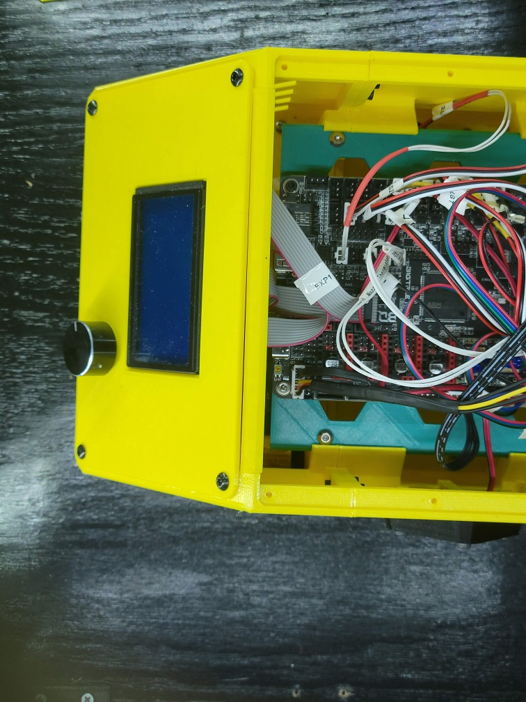](img/display_screws2.jpg) |

## 9. Lid

Like the rear panel, the lid is intended for customization. The below is an example for a simple lid with a handle.

| Step | Example |
|------|---------|
| Assemble any parts that attach to the lid first. | 
| All of the lids attach with between four (4) and eight (8) M3 x 8mm screws, although any length up to 16mm will work. |  | 

!!! note
    Because the screws are threaded directly into plastic, removing and reattaching the lid will eventually wear out the holes in the main body. I recommend starting with shorter screws and gradually switching to longer ones over time to get "fresh" plastic.
    