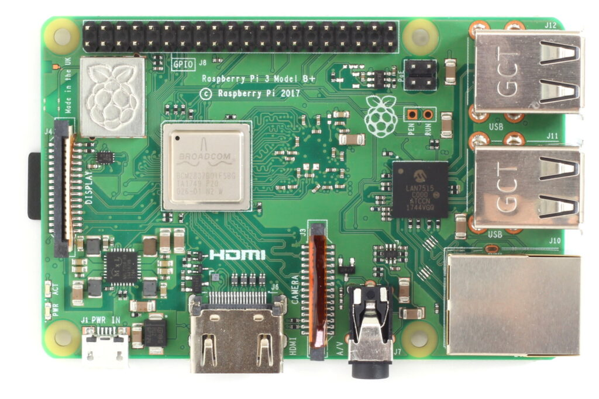
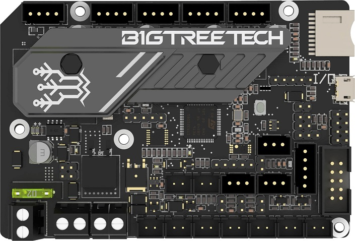
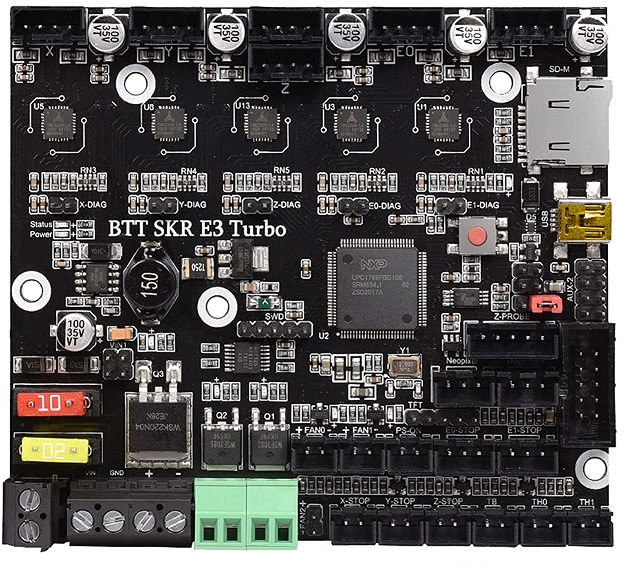

This page lists CPUs and MCUs that are currently compatible with OmniBox.

## CPU Trays

These parts are in the [Trays/CPU][15] git folder. Each component has its own subfolder.

| Component             | Image |
|-----------------------|-------|
| [Raspberry Pi 3B+][1] |  |
| [Raspberry Pi 4B][2]  |  |

## MCU Boards

These parts are in the [Trays/MCU][16] git folder. Each component has its own subfolder.

| Component             | Image |
|-----------------------|-------|
| [BTT Octopus][3]      |  |
| [BTT SKR 1.3+][4]     |  |
| [BTT SKR Mini E3][5]  |  |
| [BTT SKR E3 Turbo][5] |  |
| [Creality boards][5]  |  |

[1]: https://github.com/jon-harper/OmniBox/tree/main/Trays/CPURaspberry%20Pi%203B%20Plus
[2]: https://github.com/jon-harper/OmniBox/tree/main/Trays/CPU/Raspberry%20Pi%204B
[3]: https://github.com/jon-harper/OmniBox/tree/main/Trays/MCU/BTT%20Octopus
[4]: https://github.com/jon-harper/OmniBox/tree/main/Trays/MCU/BTT%20SKR
[5]: https://github.com/jon-harper/OmniBox/tree/main/Trays/MCU/BTT%20SKR%20E3
[15]: https://github.com/jon-harper/OmniBox/tree/main/Trays/CPU
[16]: https://github.com/jon-harper/OmniBox/tree/main/Trays/MC