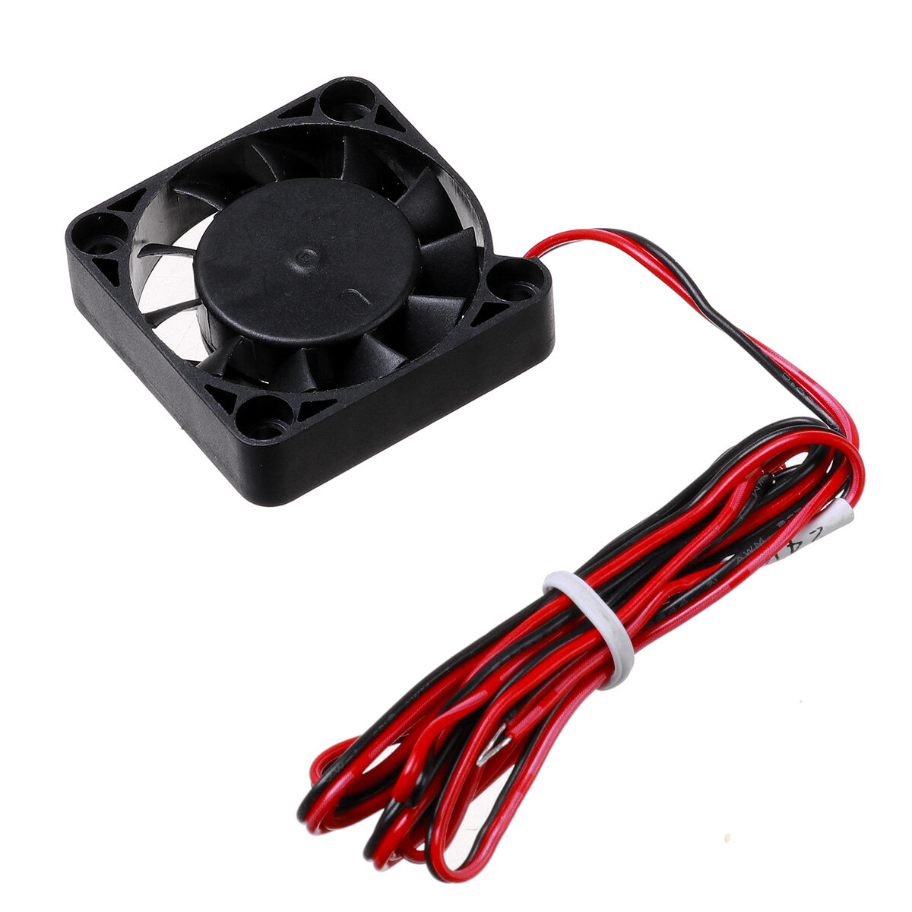
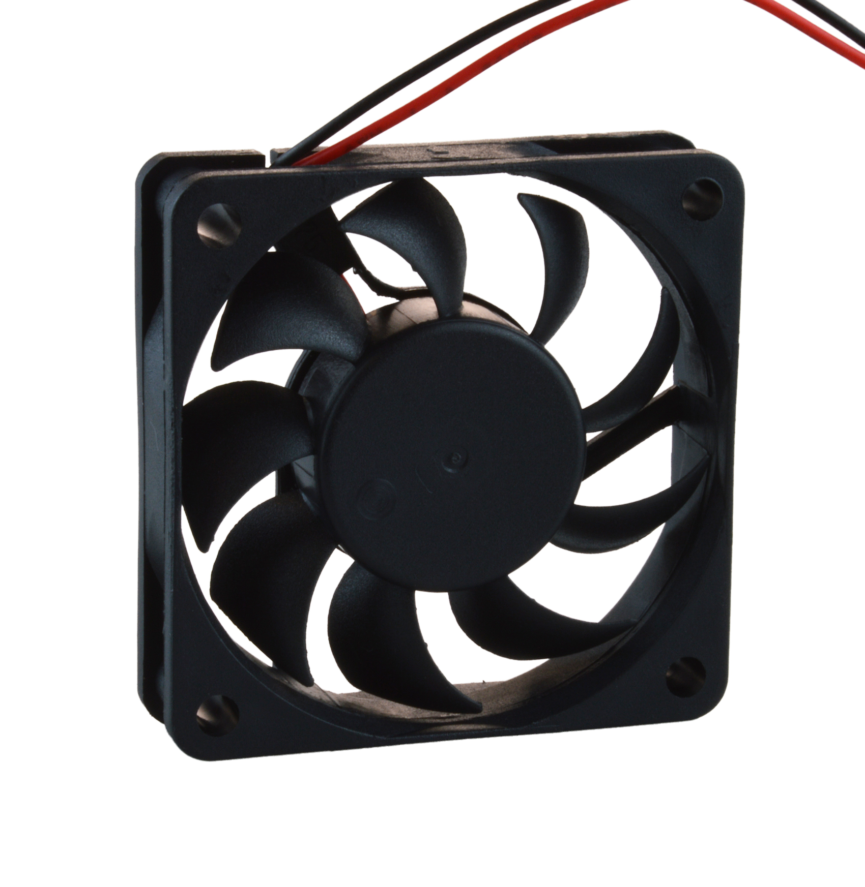
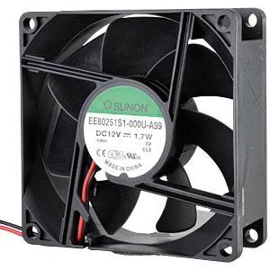

This is a list of all fans that are supported anywhere on OmniBox.

Some trays include space for 40mm fans. This is specified in the file name. 

!!! caution
    Fans larger than 40mm are typically only mountable on the rear panel or lid.

| Description | Image | Product Link | Notes |
|---|---|---|---|
| 40x40x10mm Axial Fan |  | [Example][1] | |
| 40x40x20mm Axial Fan |  | [Example][2] | |
| 60x60x15mm Axial Fan |  | [Example][3] | |
| 60x60x20mm Axial Fan |  | [Example][4] | |
| 80mm Axial Fan |  | [Example][5] | A profile exists for 80mm fans but there are not any premade panels that use them. |

[1]: https://www.amazon.com/WINSINN-Ender-Upgrade-Bearing-CR-10S/dp/B08R9JRTCT/
[2]: https://www.amazon.com/Wathai-40x40x20mm-40mm-Burshless-Cooling/dp/B07PYWVPMY
[3]: https://www.amazon.com/Security-01-Bearing-Brushless-Cooling-AV-F6015MB/dp/B071G2T6DV 
[4]: https://www.amazon.com/Wathai-60mm-Cooling-Brushless-Cooler/dp/B07NRYLRDZ
[5]: https://www.amazon.com/Security-01-Bearing-Brushless-Cooling-AV-F8025MB/dp/B071WLX5JZ