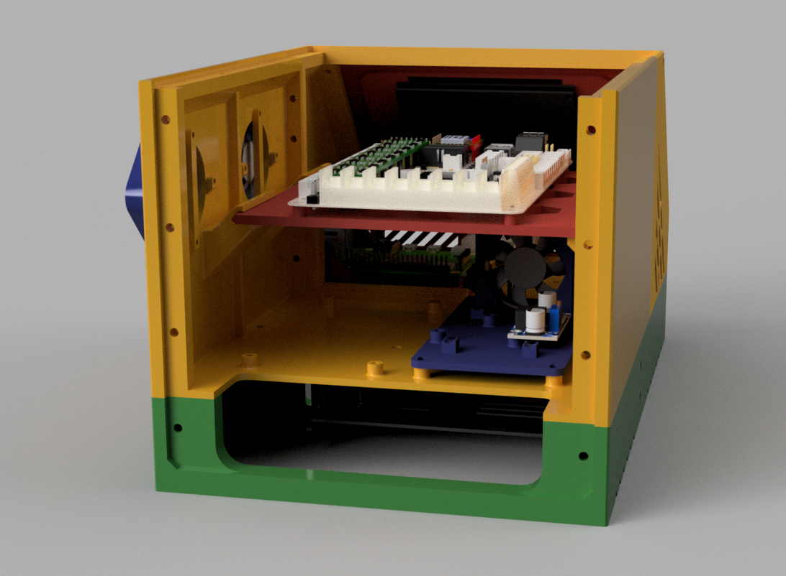
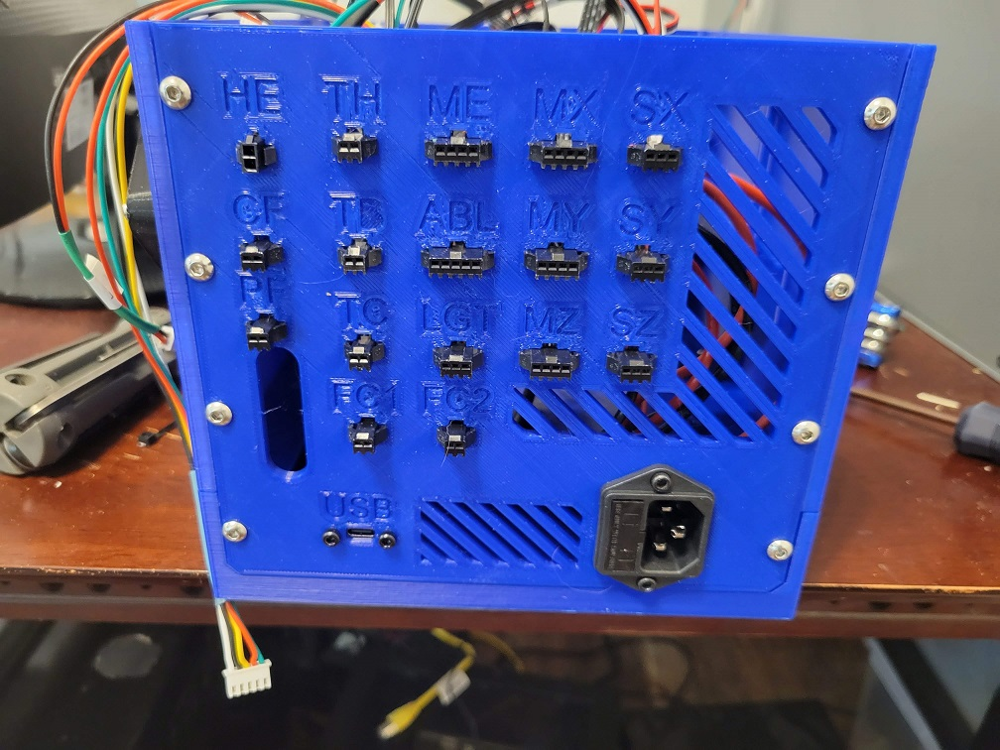

## V0.9.5 Release Renders
| Renders               |   |
|-----------------------|---|
| Rear view of new generic panel | 
| Isometric closed view |  |
| Iso open front right  |  |
| Iso open right side   |  |
| Rear view with Enclosed Ender panel |  |

## V0.9 Release Renders and Photos

| Renders and Photos  |   |
|---------------------|---|
| Big Bird V43 render |  |
| Grover's new grill  |  |
| Grover in action    |  |

## Initial Release Renders and Photos

| Renders and Photos |   |
|--------------------|---|
| Front      |  |
| Left       |  |
| Right      |  |
| Back (this is an example of one of the stock rear panels) |  |
| Render v37 |  |
| Render v42 |  |

## The Process

| Development Photos |   |
|--------------------|---|
| My only working Steve Burcham case. It has an SKR 1.4 inside (instead of an SKR 2), which is probably why it's still working. | [] |
| The initial main body prototype, looking awkward. |  |
| Size comparison: Left is an example of Steve's V5 case (with custom panels). On the right is one of the first OmniBoxes during assembly. |  |
| The first and second finished case bodies, waiting for more panels to finish printing. |  |
| Testing for fit with all of the connectors in place. |  |
| Closed up for the first time, front view. | 
| Closed up for the first time, rear view. | 