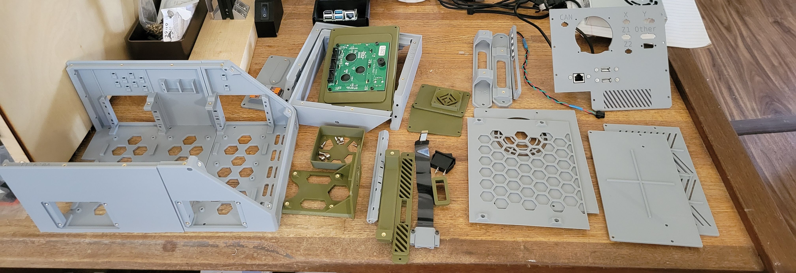
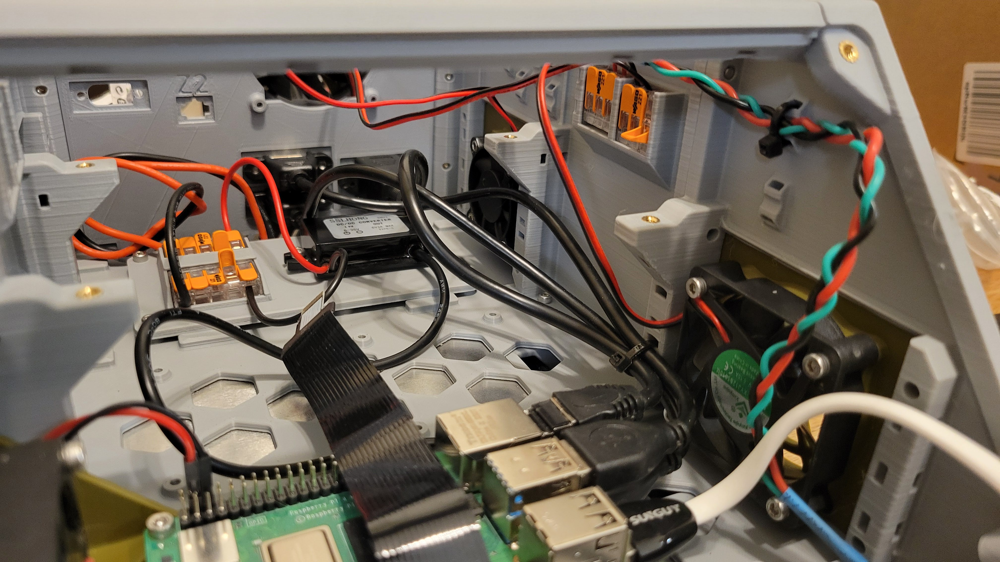
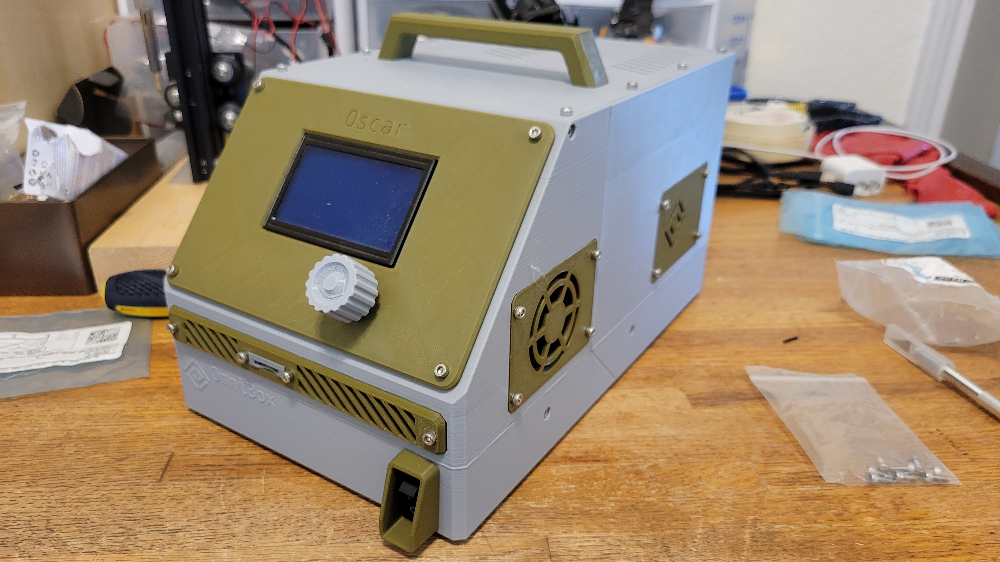
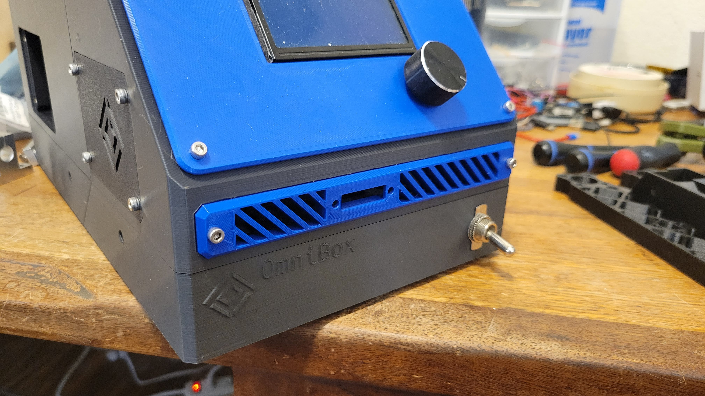
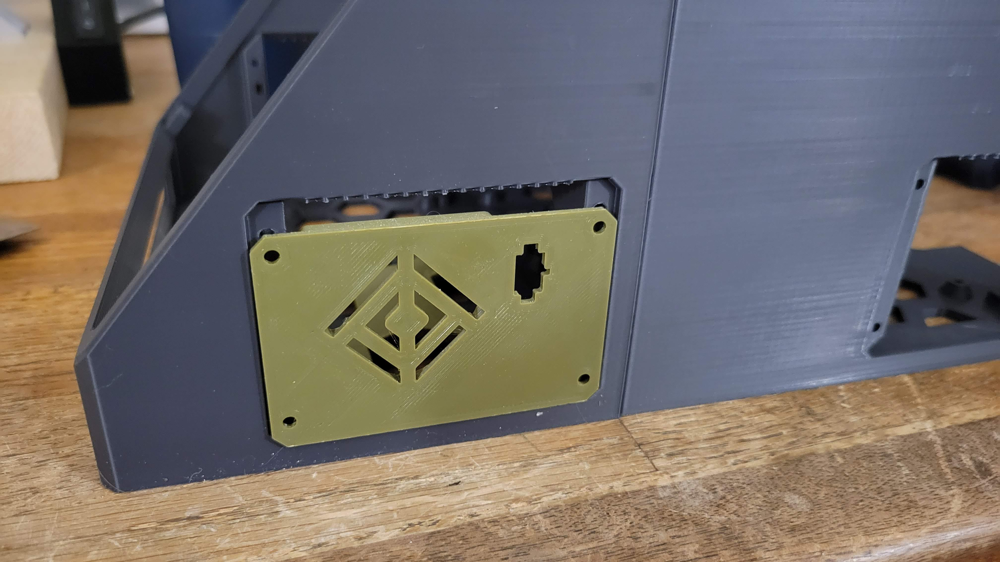



The current stable release is v0.9.11. It was released 2024/03/15.

## New Features

### Major New Features

- Improved PSU tray with templates;
- Core components come with built-in supports;
- Taller side panels;
- Reduced visibility of seams;
- A shorter standard Base;
- A second, taller Base option;
- All versions of the Base and Main Body are available as Front/Rear or Unified; and
- Built-in mounts for 3-position Wago 221 connectors.

### Additional Improvements

- Smoother external lines;
- Better printability with basic PLA;
- Numerous improvements for the Base and new options;
- Better fit for side panel heat set inserts;
- Raised MCU tray mounting height; and
- Rear Panel template now adds support to the lid.

### New Hardware Support

??? info "BIGTREETECH Manta M5P"
{{ make_indented(format.comp_entry(product.componentFromId('comp_btt_manta_m5p_v2'), prefix=prefix), '    ') }}

| Hardware                          | Mount Location(s) | Notes |
|-----------------------------------|-------------------|-------|
| BIGTREETECH Manta M5P             | MCU Tray | |
| Wago 221-413                      | Main Body | 3-position, 4x mounts |
| Mean Well RSP-200 Series          | PSU Tray | |
| SSLHONG 5V/3A buck converter      | Lower Bay | Comes with USB C connector |

## Fixes

- [Issue #118](https://github.com/jon-harper/OmniBox/issues/118): Move PSU Tray mounts forward
- [Issue #55](https://github.com/jon-harper/OmniBox/issues/55): E5+ Monolithic main body
- [Issue #117](https://github.com/jon-harper/OmniBox/issues/117): IEC socket can be inverted in the base

## Documentation & Repository

- [Documentation site](https://jon-harper.github.io/OmniBox)
    - Better tab styling.
    - BOM: rewritten for simplicity, now contains complete example BOMs.
    - Supported Hardware is now [Options & Support](../support/index.md).
    - Options & Support section is generated from a single file, simplifying updates.
    - Upgrade guide is simpler and clearer.
- [Repository](https://github.com/jon-harper/OmniBox)
    - Migrating to versioned panel and tray subfolders.
    - All BOM information is in the docs.
    - Navigation through the git repository is no longer recommended.
    
## Gallery

<figure markdown>

<figcaption markdown>
All of the parts that went into the final validation build.
</figcaption>
</figure>

<figure markdown>

<figcaption markdown>
A wired-up lower bay.
</figcaption>
</figure>

<figure markdown>

<figcaption markdown>
A completed 0.9.11 case.
</figcaption>
</figure>

<figure markdown>

<figcaption markdown>
An early dev build with a toggle switch.
</figcaption>
</figure>

<figure markdown>

<figcaption markdown>
A comparison of the old (green) and new, larger side panels.
</figcaption>
</figure>
