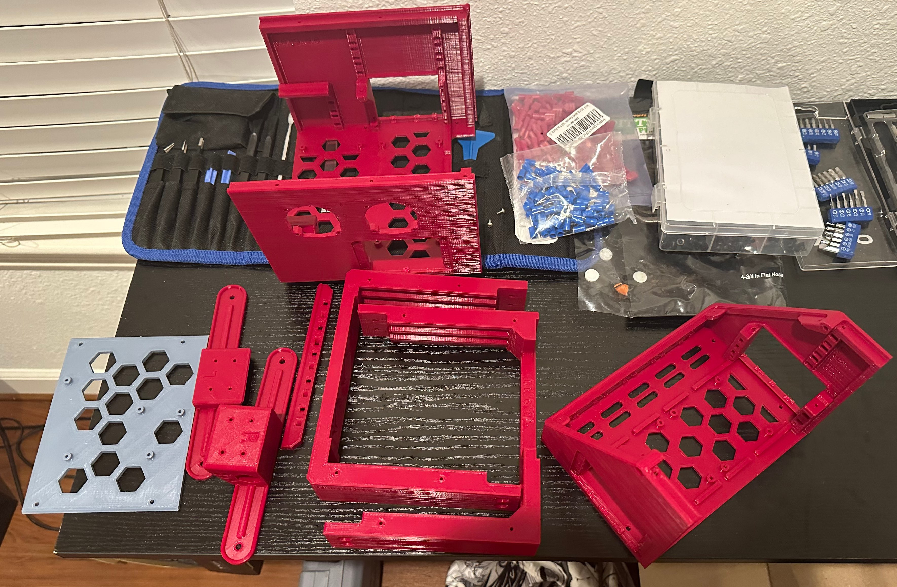

The current beta release is 0.9.10, released on 2023-07-XX.

## New Features

### Major New Features

- Added two (2) new CPU bays for a total of four (4).
- Heat set insert support changed to M3 x 5mm (OD) x 4mm (L) (Voron-style).
- Front base support for toggle switches.
- Rear main body with two (2) external fans replaced by a four (4) interal mounts.
- "Full HSI" case option with most fasteners mating with an insert.

### Additional Improvements

- **Improved:** Crossbar version added with HSI support, better zip tie anchors.
- **Improved:** Long lower bay trays now mount sideways, one additional tray available.
- **Added:** Additional zip tie anchors, particularly to the front main body.
- **Improved:** CPU tray guides take up significantly less room.
- **New:** Support for 12mm and 12.5mm toggle switches.

### New Hardware Support

| Hardware                          | Mount Location(s) | Notes |
|-----------------------------------|-------------------|-------|
| Mean Well SE-450                  | PSU Tray          | |
| Mean Well LRS-450                 | PSU Tray          | |
| Mean Well LRS-600                 | PSU Tray          | Fit test needed. |
| Mean Well LRS-25-5                | Lower bay tray    | Contributed by [Mr Meh][contrib_mr_meh]. |
| Creality 2.X MCUs                 | MCU Tray          | Contributed by [Mr Meh][contrib_mr_meh]. |
| FYSETC Spider                     | MCU Tray          | Contributed by [Killajoedotcom][contrib_killajoedotcom]. |
| MKS Monster8                      | MCU Tray          | Fit test needed. |
| MKS Skipr                         | MCU Tray          | Fit test needed. |
| BIGTREETECH 5" Pi TFT             | Display Panel     | Contributed by [MaffooClock][contrib_maffooclock]. |
| Omron puck-style relays           | Lower bay tray    | Compatible with most clones. |
| BIGTREETECH U2C CAN adapter       | Lower bay tray    | Contributed by [edgy][contrib_edgy]. |
| 50mm x 12mm fans                  | Any panel         | 50x10 and 50x15 pending fit tests. |

## Fixes

- [Issue #91][1]: Display template is faulty
- [Issue #81][2]: Lower bay tray standoffs need a fillet
- [Issue #59][3]: Micro Fit 3 pinouts for rear panels are missing
- [Issue #94][4]: Add a power switch cover to prevent accidental bumping

## Documentation & Repository

- [Documentation site](https://jon-harper.github.io/OmniBox)
    - Added contribution information.
    - Cleaned up wording on introductory pages.
    - All fixed BOM parts have example links.
- [Repository](https://github.com/jon-harper/OmniBox)
    - Some file names have additional qualifiers where multiple variations now exist, e.g. "stock" vs. "HSI".
    
## Gallery

<figure markdown>

<figcaption markdown>
An OmniBox with external 50mm fan and keystone jack extensions.
</figcaption>
</figure>

<figure markdown>

<figcaption markdown>
Front view of a completed OmniBox with power switch cover and rear-mounted 60mm fan.
</figcaption>
</figure>

<figure markdown>

<figcaption markdown>
The new Mean Well bottom panel allows the PSU to exhaust directly out of the case.
</figcaption>
</figure>

<figure markdown>

<figcaption markdown>
Everything but the panels, ready to assemble the Core case. Photo courtesy Matrixsenpai.
</figcaption>
</figure>

<figure markdown>

<figcaption markdown>
A freshly-printed PETG Rear Main Body. Photo courtesy Matrixsenpai.
</figcaption>
</figure>

[1]: https://github.com/jon-harper/OmniBox/issues/91
[2]: https://github.com/jon-harper/OmniBox/issues/81
[3]: https://github.com/jon-harper/OmniBox/issues/59
[4]: https://github.com/jon-harper/OmniBox/issues/94