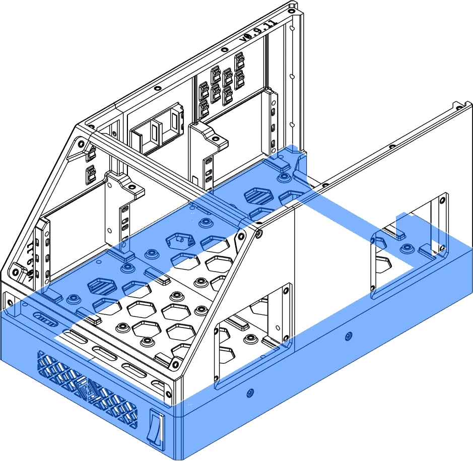





This page lists the configurations available for OmniBox's Base and discusses the options available.

<figure markdown>
[{width="480px"}](../img/components/base.webp)
<figcaption markdown>
The Base is the foundation of an OmniBox case.
</figcaption>
</figure>

## Base Options

### Base Depth

Before printing a specific base, ensure it is deep enough for your power supply (you can check this on the
[:octicons-checklist-24: PSU Trays](psu.md) page).

### Power Switch

The OmniBox Base can be printed to accept either a 29mm x 10.5mm snap-in SPST rocker switch or a 12mm toggle switch.

Larger power supplies are not compatible with toggle switches. Check the [:octicons-checklist-24: PSU Trays](psu.md)
page for more.

### IEC C14 Power Socket

Power is provided through a standard fused IEC C14 power socket. The Basic base is available for users with different
power inlet needs (e.g. a power inlet with integrated switch).

## Bases


{{ format.comp_entry(comp, prefix=prefix) }}
