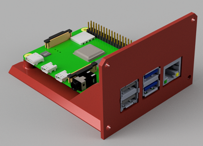

This page lists CPUs and MCUs that are currently compatible with OmniBox.

Each component name links to the corresponding git folder.

## SoC CPU Boards

These parts are in the [Trays/CPU][7] git folder. Each component has its own subfolder. Currently, SoC CPUs other than the Raspberry Pi are not yet supported.

If you do not use a CPU board, a [blank slot cover][6] can be used.

| Component             | Image |
|-----------------------|-------|
| [Raspberry Pi 3B+][1] |  |
| [Raspberry Pi 4B][2]  |  |

## MCU Boards

These parts are in the [Trays/MCU][8] git folder. Each component has its own subfolder. There are `STEP` and Fusion template files available for adding support for other boards.

| Component             | Supported Versions | Image |
|-----------------------|----------|-------|
| [BTT Octopus][3]      | All      |  |
| [BTT SKR][4]          | 1.3+     |  |
| [BTT SKR Mini E3][5]  | All      |  |
| [BTT SKR E3 Turbo][5] | All      |  |
| [Creality boards][5]  | All      |  |

[1]: https://github.com/jon-harper/OmniBox/tree/main/Trays/CPURaspberry%20Pi%203B%20Plus
[2]: https://github.com/jon-harper/OmniBox/tree/main/Trays/CPU/Raspberry%20Pi%204B
[3]: https://github.com/jon-harper/OmniBox/tree/main/Trays/MCU/BTT%20Octopus
[4]: https://github.com/jon-harper/OmniBox/tree/main/Trays/MCU/BTT%20SKR
[5]: https://github.com/jon-harper/OmniBox/tree/main/Trays/MCU/BTT%20SKR%20E3
[6]: https://github.com/jon-harper/OmniBox/tree/main/Trays/CPU/Unused%20Tray%20Cover
[7]: https://github.com/jon-harper/OmniBox/tree/main/Trays/CPU
[8]: https://github.com/jon-harper/OmniBox/tree/main/Trays/MCU