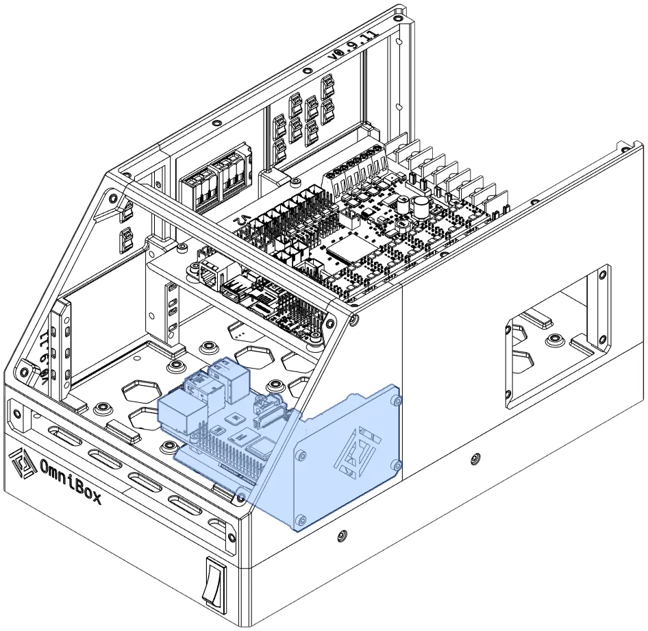







This page lists system-on-a-chip (SoC) CPUs currently compatible with OmniBox. These are commonly known as single board computers (SBC).

<figure markdown>
  [{ width="480" }](../img/components/cpu.webp)
  <figcaption>CPU trays can be mounted on the left or right side of the case.</figcaption>
</figure>

If you do not use an SBC, the side of the CPU bay can be used as a [Side Panel](side.md).


{{ format.comp_entry(comp, prefix) }}
