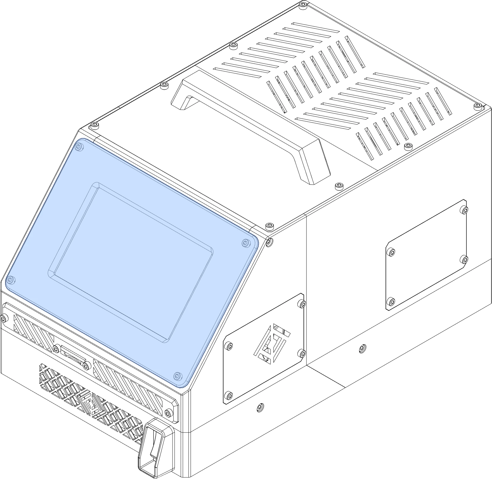





This page lists all displays compatible with OmniBox.

<figure markdown>
[{width="480px"}](../img/components/display.webp)
<figcaption markdown>
Display panels are the primary method of interacting with your OmniBox.
</figcaption>
</figure>


{{ format.comp_entry(comp, prefix=prefix) }}
