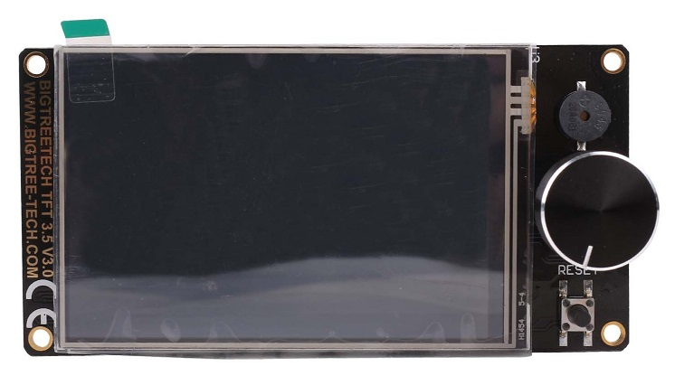

:material-alpha-p-box: :material-alpha-d-box-outline: Display Panels mount two different types of display screens:

- MCU displays include various TFT and older 128x64 character LCD diplays.
- Raspberry Pi displays are TFT displays, usually used with OctoPrint or Klipper.

## MCU Displays

<figure markdown>
  [![front left render][img_display]{ width="480" }][img_display]
  <figcaption>12864 TFT display mounted on a panel.</figcaption>
</figure>

Each supported MCU display screen has a subfolder in the [`/Panels/Display`][git_display] git folder. There is an optional STL file for a [replacement display knob][git_display_knob], as well.

Component names below link to the corresponding git folder.

| Component            | Image | Notes |
|----------------------|--------|-------|
| [Generic 12864][git_generic_12864] |  | Also known as Creality CR-10 stock display; comes on most Creality printers. |
| [FYSETC Mini 12864][git_mini_12864] |   | This includes BTT brand and other clones. |
| [BIGTREETECH 2.4" TFT][git_btt_tft_24] |   | This product is discontinued, but I still use it, so there's a part. |
| [BIGTREETECH 3.5" TFT][git_btt_tft_35] |   | Note that this is not the E3 version, which would use the Generic 12864 mount. |
| [BIGTREETECH 3.5" TFT E3][git_generic_12864] | ![img]  | Uses the Generic 12864 mount. |
| [BIGTREETECH 5.0" TFT][git_btt_tft_50] |   | |

Most mounts require four (4) 6mm or M3 screws to fasten the display in place. Some mounts have two or three pieces and require additional screws.

## Raspberry Pi Displays

### Compatibility

Any TFT designed with mounts points for a Raspberry Pi on the back should be compatible.

Compatible examples include:

- BIGTREETECH Pi TFT displays (using included hardware)
- Raspberry Pi-branded 7" TFT (with additional standoffs and M2.5 screws)

### Mounting Methods

These displays can be attached in one of two ways:

- In place of the MCU display as a [:material-alpha-p-box: :material-alpha-d-box-outline: Display Panel][git_display_pi_tft],
- Or as a [:material-alpha-p-box: :material-alpha-l-box-outline: Lid][git_lid_pi_tft] above the MCU display mount.

See below for examples.

<figure markdown>
  [![render of Raspberry Pi TFT in place of an MCU display][img_rpi_display]{ width="480" }][img_rpi_display]
  <figcaption>Raspberry Pi TFT on a display panel.</figcaption>
</figure>

<figure markdown>
  [![render of Raspberry Pi TFT as a secondary display][img_rpi_lid]{ width="480" }][img_rpi_lid]
  <figcaption>Raspberry Pi TFT mounted as a lid.</figcaption>
</figure>

[img_display]: ../img/components/display.png
[img_rpi_display]: ../img/examples/rpi_display.png
[img_rpi_lid]: ../img/examples/rpi_lid.png