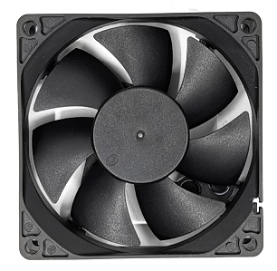

This is a list of all fans that are supported by OmniBox.

An assortment of :material-alpha-f-box: :material-alpha-c-box-outline: fan cages and :material-alpha-f-box: :material-alpha-g-box-outline: fan gaskets are available in the [Fan Cages][6] git folder for all listed fans.

OmniBox also has optional, concealed mounts for 40x40x10mm fans. These are compatible with gaskets but do not use fan cages.

| Description | Image | Product Link |
|---|---|---|
| 40x40x10mm Axial Fan |  | [Example][1] |
| 40x40x20mm Axial Fan |  | [Example][2] |
| 60x60x15mm Axial Fan |  | [Example][3] |
| 60x60x20mm Axial Fan |  | [Example][4] |
| 60x60x25mm Axial Fan |  | [Example][7] |
| 80x80x20mm Axial Fan |  | [Example][8] |
| 80x80x25mm Axial Fan |  | [Example][5] |
| 92x92x25mm Axial Fan |  | [Example][9] |

[1]: https://www.amazon.com/WINSINN-Ender-Upgrade-Bearing-CR-10S/dp/B08R9JRTCT/
[2]: https://www.amazon.com/Wathai-40x40x20mm-40mm-Burshless-Cooling/dp/B07PYWVPMY
[3]: https://www.amazon.com/Security-01-Bearing-Brushless-Cooling-AV-F6015MB/dp/B071G2T6DV 
[4]: https://www.amazon.com/Wathai-60mm-Cooling-Brushless-Cooler/dp/B07NRYLRDZ
[5]: https://www.amazon.com/Security-01-Bearing-Brushless-Cooling-AV-F8025MB/dp/B071WLX5JZ
[6]: https://github.com/jon-harper/OmniBox/Fan%20Cages
[7]: https://www.amazon.com/Wathai-60mm-25mm-Brushless-Cooling/dp/B07Q2JWNFX
[8]: https://www.amazon.com/GDSTIME-Brushless-Cooling-Sleeve-Bearing/dp/B07MDYBSGR
[9]: https://www.amazon.com/GDSTIME-90x90x25mm-Inches-Brushless-Cooling/dp/B07LFZKCC6