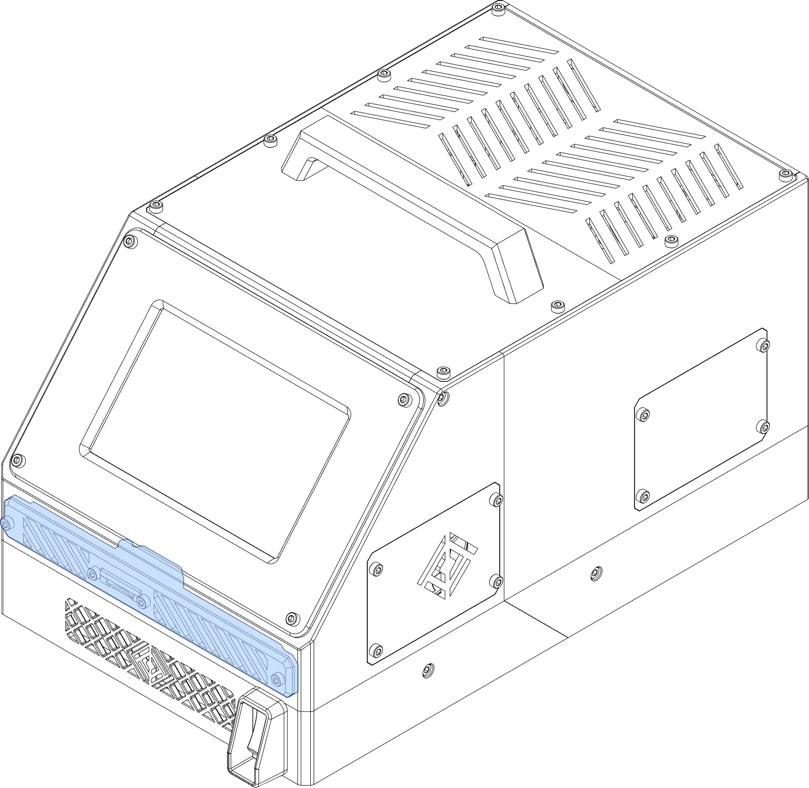
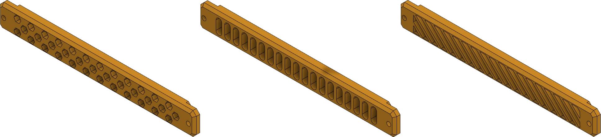





This page lists all front panels for OmniBox.

<figure markdown>
[{width="480px"}](../img/components/front_panel.webp)
<figcaption markdown>
Front panels provide ventilation and can mount SD card extensions, USB connectors, or even LED lights.
</figcaption>
</figure>

Panels normally have one of three vent styles:
<figure markdown>
[{width="480px"}](../img/components/fp_styles.webp)
</figure>

1. Hexagons (Left)
2. Slots (Center)
3. Angled Slats (Right)


{{ format.comp_entry(comp, prefix=prefix) }}
