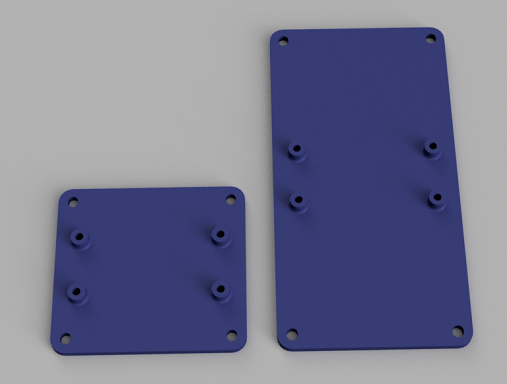
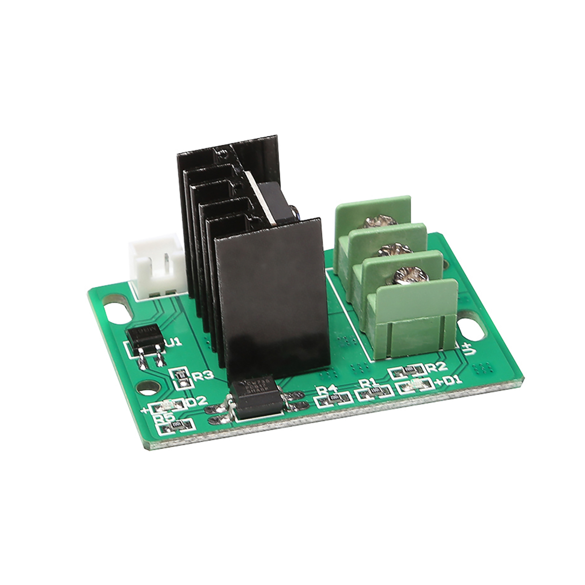

:material-alpha-t-box: :material-alpha-l-box-outline: Lower Bay Trays mount below the MCU board and are used for a wide range of parts. Parts compatible with the lower bay are listed here. The [Trays\Lower Bay][5] git folder is organized with subfolders for each supported part. All variations based around that part are in the same folder.

There are two types of :material-alpha-t-box: :material-alpha-l-box-outline: Lower Bay Trays: half and full. A full length tray covers the mount points of two half trays and must be mounted from front to back of the case.

## Buck Converters

| Description | Image | Product Link | Tray Sizes | Notes |
|----|---|---|---|---|
| Basic LM2596 Buck Converter |  | [Example][1] | Half (single, dual), Full (single, dual) |
| "DROK" LM2596 with LED       |  | [Example][2] | Half (single), Full (single, dual) | Mounting holes: 60.5mm x 30.5mm |
| "HiLetgo" LM2596 with LED |  | [Example][3] | Half (single), Full (single, dual) | Mounting holes: 49.5mm x 27.5mm |
| "DROK" 5A Buck with LED |  | [Example][6] | Full (single) | Mounting Holes: 63mm x 40.5mm |

## MOSFETs

| Description | Image | Product Link | Tray Sizes | Notes |
|---|---|---|---|---|
| Creality MOSFET |  | [Example][4] |  Half (single), Full (single) | |

## Solid State Relays (SSRs)

| Description | Image | Product Link | Tray Sizes | Notes |
|---|---|---|---|---|
| Fotek SSR-40 DA |  | [Example][7] |  Half (single), Full (single) | |

[1]: https://www.amazon.com/Valefod-Efficiency-Voltage-Regulator-Converter/dp/B076H3XHXP
[2]: https://www.amazon.com/Converter-DROK-Transformer-Regulator-Stabilizer/dp/B00JUFJ1GA
[3]: https://www.amazon.com/HiLetgo-Step-down-Converter-1-25-37V-Voltmeter/dp/B00LSEBYHU/
[4]: https://www.tinymachines3d.com/products/crmfet
[5]: https://github.com/jon-harper/OmniBox/tree/main/Trays/Lower%20Bay
[6]: https://www.amazon.com/DROK-Adjustable-Converter-Transformer-Protective/dp/B07JZ2GQJF
[7]: https://www.amazon.com/SSR-40DA-Solid-Output-24-380V-SSR-40/dp/B07FVHWN82