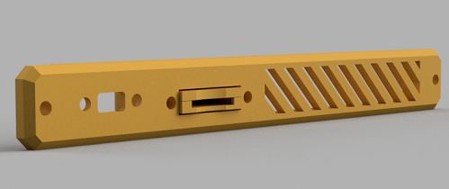

## Using Panel Mounts

 Connector panel mounts will typically be on the rear panel and connect with the printer. Extensions can be mounted on the front or rear and are typically for SD Cards and USB ports.

### :material-alpha-p-box: :material-alpha-f-box-outline: Front Panels

The front panel is long and slim and can be used for mounting small hardware ports. The most common examples are SD Card extensions and USB extensions. You can find these files in the [`Panels/Front Panel`][git_front_panel] git folder.

The example below has a Micro SD extension and USB-C extension with slat-style vents.

### :material-alpha-p-box: :material-alpha-s-box-outline: Side Panels

Introduced in version 0.9.9, the side panel replaces the old Unused CPU Cover. Side panels can be used for mounting a single 40mm fan, panel mounted connectors, or keystone jacks.

Files for the side panel can be found in the [`Panels/Side Panel`][git_side_panel] git folder.

### :material-alpha-p-box: :material-alpha-r-box-outline: Rear Panels

Rear Panels are the most customizable part of OmniBox. They can mount connectors and fans and modified to suit each end user. There are also a number of generic templates available in the [`Panels/Rear Panel`][git_rear_panel] git folder.

This rear panel uses Molex Micro Fit 3 connectors. In addition, it has a cutout for a 60mm fan and USB-C extension.

## Supported Hardware

In addition to [fans][fans], templates and predesigned panels are available to mount the following hardware:

| Connector or Extension | Typical Location | Notes |
|------------------------|----------|-------|
| [MicroSD panel mount extension][5] | Front | |
| [USB B panel mount extension][4] | Front or Rear | Right angle connector fits most boards more easily. |
| [USB C panel mount extension][3] | Front or Rear | |
| [JST SM panel mount connectors][2] | Rear | 2-5 pins |
| [Molex Micro Fit 3.0 connectors][1] | Rear | Supported up to [2-row, 16-position][6]. |
| Keystone Jacks | Front, Side, Rear | Currently only the side panel has a predesigned keystone jack mount. |

[1]:  https://www.digikey.com/en/htmldatasheets/production/1626160/0/0/1/0430300007.html
[2]:  https://www.amazon.com/gp/product/B07D9HRDT6
[3]:  https://www.amazon.com/Poyiccot-Extension-Female-Extender-Straight/dp/B086W2R8Z6
[4]:  https://www.amazon.com/gp/product/B071P2BGK5
[5]:  https://www.amazon.com/gp/product/B07YYSP5F5
[6]:  https://www.digikey.com/en/products/detail/molex/0430200200/252490

[fans]: fans.md