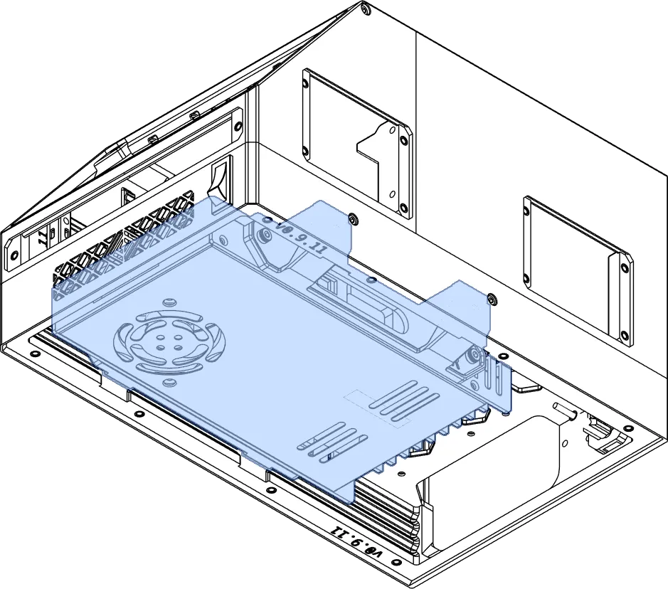







This page lists power supplies (PSUs) currently supported by OmniBox.

<figure markdown>
  [{ width="480" }](../img/components/psu.webp)
  <figcaption>Power supplies are mounted underneath the case body.</figcaption>
</figure>

!!! note "Note: Mean Well Clones"
    There are several brands of clones, usually using the same model number as Mean Well. The most common of these is the Landy LRS-350-24. These clones are generally compatible with the Mean Well trays.


{{ format.comp_entry(comp, prefix) }}
