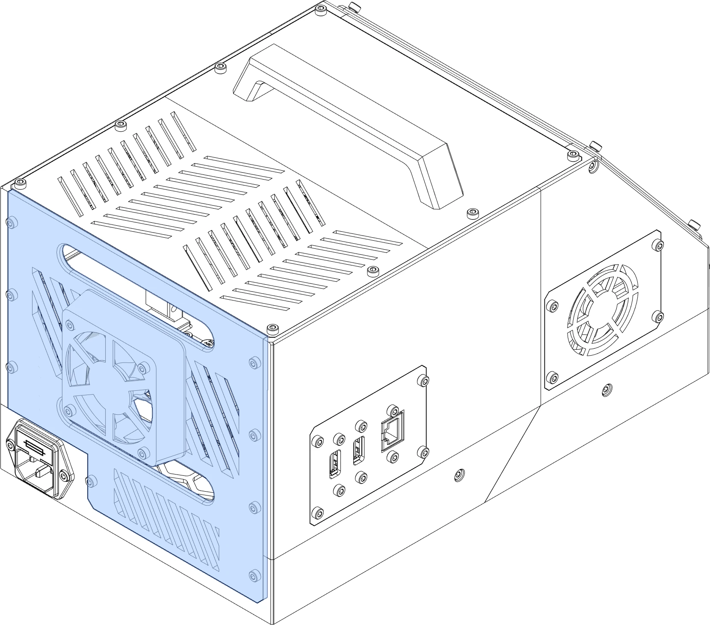





The rear panel is highly customizable with the [Rear Panel Template](../upgrade/templates.md#rear-panel).

<figure markdown>
[{width="480px"}](../img/components/rear.webp)
<figcaption markdown>
In addition to acting as a wiring passthru for your printer, rear panels are a major ventilation source.
</figcaption>
</figure>


{{ format.comp_entry(comp, prefix=prefix) }}
